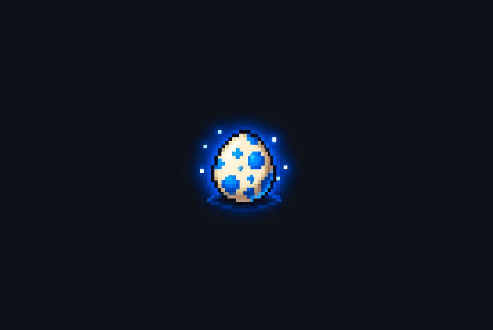

<!-- HERO — replace path with your screenshot -->

  

<h1 align="center">DigiRogue</h1>

  A PokeRogue-style Digimon roguelike built in Godot 4.6 
  50-floor dungeon crawl · 31 Digimon · 4 evolution stages · Gacha collection

  
  
  
  

---

## Product Tour

DigiRogue is a stage-based roguelike inspired by PokeRogue and Time Stranger. The player picks starter Digimon, pushes through 50 floors of battles, mystery doors, shops, and boss fights, and tries to reach the end with a strong evolved party.

<!-- REPLACE: screenshot of StarterSelect screen -->

  

The experience follows a simple loop:

- **Choose your party** — pick up to 3 starters from 8 Rookie Digimon (or gacha-pulled Champions), each with unique types, stats, and evolution paths.
- **Push through 50 floors** — 5 biomes (Beach → Plains → Forest → Castle → Demon Realm) with scaling enemies, boss fights every 5 floors, and mystery doors between battles.
- **Battle with strategy** — Pokemon-style turn combat with type advantages (Vaccine > Virus > Data > Vaccine), status effects (Burn, Poison, Freeze, Paralysis, Confuse), SP management, and mid-battle digivolution.
- **Collect and evolve** — scan enemies to 200% to catch them, earn gacha tickets from rare item drops, and digivolve your partners through 4 evolution stages (Rookie → Champion → Ultimate → Mega).

---

## Features

| Area | Capability |
|---|---|
| **Starters** | 8 Rookie Digimon with full evolution lines (31 total across 4 stages) |
| **Battle** | Pokemon-style turn combat with type chart, crits, status effects, stat modifiers, SP system |
| **Digivolution** | Level-based evolution (Lv.16/36/50) with stat preservation and Pokemon-style boost |
| **Gacha** | Ticket-based gacha with star system — 2 stars unlock Dormant Ability, 5 stars unlock Rare Passive |
| **Collection** | Scan enemies 0–200% per type; catch at 200%; capacity-based party system |
| **50 Floors** | Beach → Plains → Forest → Castle → Demon Realm with area-scaled difficulty |
| **Boss Fights** | Every 5 floors — Greymon, Garurumon, Devimon, MagnaAngemon, Garudamon, MetalGarurumon, WarGreymon, VenomMyotismon |
| **Mystery Doors** | Ally Digimon (62%), Training Ground (19%), Shop (14%), Demon Realm warp (5–35%) |
| **Items** | 34 items across 7 categories — heals, revives, SP, cures, stat chips, food, gacha tickets |
| **Rewards** | 3 paid + 3 free item slots per battle, reroll system, PC storage access |
| **Party System** | Fighting party (max 20 capacity), Guests (max 4), PC Storage (30 slots) |
| **Cloud Save** | Firebase Firestore sync for gacha data across devices |
| **Auth** | Google Sign-In (web popup + desktop OAuth 2.0 with PKCE) |
| **Settings** | Live UI color customization with persistent save |
| **Web Build** | Pre-built WASM export, runs in Chrome/Edge/Firefox |

---

## Screens

### MainMenu

<!-- REPLACE: screenshot of MainMenu -->

  

Title screen with Google login, guest mode, and best run display.

### StarterSelect

<!-- REPLACE: screenshot of StarterSelect -->

  

Choose up to 3 starters from 8 Rookie Digimon. View stats, moves, type, evolution chain. Access the Digimon Gacha to pull Champions.

### StageMap

<!-- REPLACE: screenshot of StageMap -->

  

50-floor roguelike progression map. Linear path with mystery doors, boss markers, party management, and shop access.

### BattleScene

<!-- REPLACE: screenshot of BattleScene -->

  

Full Pokemon-style battle UI — enemy info (top-left), player info (right), area indicator with floor number (top-left), 4-button menu (Fight / Digivice / Run / Digimon), move selection, item usage, digivolve mid-battle, catch system.

### RewardScene

<!-- REPLACE: screenshot of RewardScene -->

  

Post-battle victory — XP/digi rewards, level-up stat changes, digivolution notifications, 3 paid + 3 free item picks, reroll, PC storage.

---
